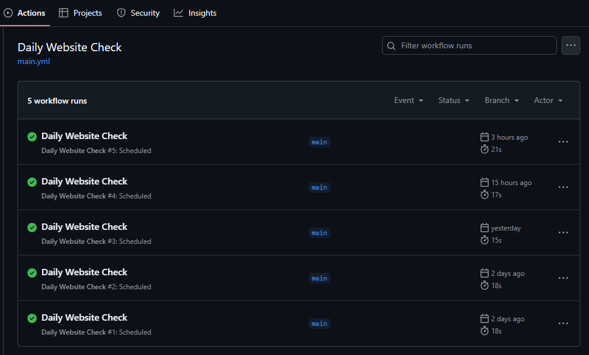

# Daily Website Availability Checker

This script checks if a specified website is available at scheduled times each day (e.g. 12:00 AM and 12:00 PM UTC) using GitHub Actions. If the website fails to load, it will keep retrying until successful.

## Features

- Checks website availability.
- Retries every 5 seconds if the website is unavailable.
- Logs a success message with a timestamp once the website loads successfully. (see Actions)
